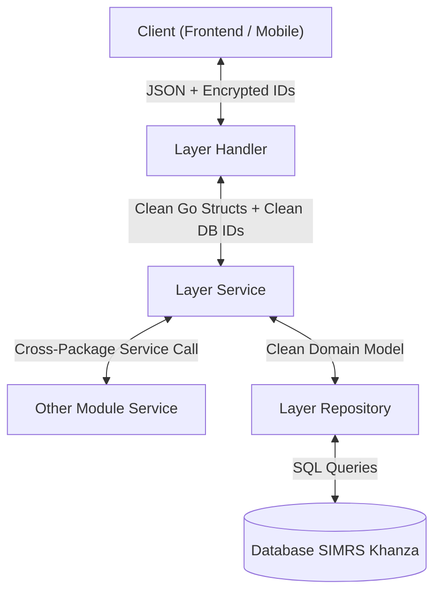

# Panduan Pengembang & Arsitektur (AGENTS.md)

> [!IMPORTANT]
> **KONTRAK WAJIB AI AGENT & PENGEMBANG**:
> Dokumen ini adalah spesifikasi arsitektur dan aturan utama yang **WAJIB DIBACA, DIPAHAMI, DAN DIIKUTI SECARA MUTLAK TANPA KECUALI** oleh setiap AI Agent dan pengembang sebelum menganalisis, merancang, menulis kode baru, maupun merefaktor di repositori **`erm-dokter`**.
> 
> **Aturan Utama**:
> 1. **KONSISTENSI KODING ANTAR-FITUR**: Sebelum membuat fitur baru atau merefaktor, **WAJIB mempelajari fitur-fitur yang sudah ada** untuk memahami struktur arsitektur, pola helper validasi, dan cara kodingnya. Dilarang membuat pola baru yang berbeda sendiri (*no ad-hoc patterns*).
> 2. **Modul acuan baku (*Gold Standard*) repositori ini**:
>    - **`internal/resep`** (Standar referensi untuk transaksi CRUD kompleks, validasi master data, dan relasi multi-tabel).
>    - **`internal/pemeriksaan`** (Standar referensi untuk validasi format non-DB, validasi rentang nilai klinis, dan batasan rekam medis).
>    - **`internal/penilaianmedis`** (Standar referensi untuk modularitas berkas per unit layanan: `ralan`, `igd`, `ranap`).
> 3. **LARANGAN MUTLAK KODE & KONDISI REDUNDAN (*Zero Redundant Logic & Checks*)**:
>    - **DILARANG KERAS membuat kode, percabangan, validasi ganda, atau pengecekan kondisi yang redundan (*no redundant code*)**.
>    - Pada **Layer Handler** dengan identifier komposit (*composite key* seperti pada `internal/pemeriksaan`, `internal/diagnosa`), validasi integritas URL path **CUKUP memverifikasi kecocokan entitas induk** (`idComposite.NoRawat != noRawatURL`).
>    - DILARANG menumpuk kondisi ganda yang mubazir (misal: `idComposite.NoRawat != noRawat || idComposite.Status != statusURL`) karena isolasi data sudah dijamin oleh entitas induk dan aturan status data merupakan tanggung jawab Layer Service. Wajib mengikuti pola acuan baku `internal/pemeriksaan/handler.go`.


---

## 1. Ikhtisar Proyek & Struktur Clean Architecture

- **Bahasa & Runtime**: Go (Golang) 1.22+
- **Routing**: Go Standard Library `net/http` (`http.ServeMux` dengan method routing Go 1.22+).
- **Database**: MySQL / MariaDB (Database SIMRS Khanza).
- **Live Reload**: `air` (sudah mendukung ekstensi `.go`, `.yaml`, `.yml`, `.json`, `.html`, `.env`).
- **Dokumentasi API**: Scalar API Reference terintegrasi di `GET /docs` (Spesifikasi modular OpenAPI 3.1.0 di `internal/docs/base.yaml` & `internal/docs/modules/*.yaml`).

### Struktur Lapisan (Layered Architecture & Manual DI)

```
internal/
├── auth/           # Login dokter, token JWT, profile
├── master/         # Master data (Penjamin, Depo Farmasi, Poliklinik)
├── rawatjalan/     # Antrean pasien dokter, detail & riwayat kunjungan
├── rawatinap/      # Asesmen & status kamar inap pasien rawat inap
├── pemeriksaan/    # SOAP & TTV (Ralan & Ranap), riwayat, CRUD, validasi 48 jam
├── obat/           # Pencarian & detail master obat per depo, cek keberadaan obat
├── resep/          # Resep obat dokter (non-racikan, racikan), master aturan & metode
├── rujukaninternal/# Rujukan internal antar-poli/dokter dalam satu kunjungan
├── penilaianmedis/ # Asesmen awal medis dokter per unit (ralan, igd, ranap)
├── resumepasien/   # Resume medis pasien (Ralan & Ranap / discharge summary)
├── tindakan/       # Master tindakan medis & tarif laboratorium (PK, PA, MB)
├── laboratorium/   # Hasil lab pasien, order permintaan lab dokter (PK, PA, MB)
├── radiologi/      # Hasil ekspertise & integrasi gambar PACS radiologi pasien
├── berkasdigital/  # Streamer reverse proxy berkas digital rekam medis universal
├── pasien/         # Data profil & riwayat kunjungan pasien (cross ralan & ranap)
├── middleware/     # Auth JWT Middleware (Bearer), Timeout Middleware
├── routes/         # Centralized HTTP route multiplexer
├── di/             # Manual Dependency Injection (providers)
├── pkg/            # Utilitas inti: crypto (AES-GCM), token, database, logger, response
└── shared/         # Model bersama, enum StatusLanjut, validasi waktu & validator
```

---

## 2. Standar Desain, Batasan Lapisan & Konvensi Mutlak

### A. Pembagian Tanggung Jawab Lapisan (Layer Responsibilities & Boundary Separation)

Setiap lapisan memiliki batasan tanggung jawab yang tegas dan **DILARANG KERAS saling mencampurkan logika**:



#### 1. Layer Model (`model_*.go`):
- Berisi definisi struct domain utama dan struct payload request/response.
- Gunakan tag `json:"-"` pada field internal database (misal `KodeObat`, `KodeTindakan`, `NoRawat`) yang tidak diekspos mentah ke client.
- **`Sanitize()`**: Khusus untuk mutasi data murni: pemangkasan spasi (`strings.TrimSpace`), normalisasi format (misal auto-append `:00` jika jam `HH:mm`), dan pemberian nilai default (misal string kosong menjadi `"-"`). **Method `Sanitize()` DILARANG mengembalikan error**.
- **`Validate()`**: Murni evaluasi aturan validasi non-database (*read-only*) dan mengumpulkan error ke `apperror.ValidationError`.
  - Wajib memvalidasi waktu masa depan (*future time*): `waktu.After(time.Now())`.
  - Wajib memvalidasi kelengkapan string dan elemen sub-array.
  - **Method `Validate()` DILARANG memutasi atau mengubah nilai field struct**.
- **Komposisi Struct & Eliminasi Duplikasi (Composition over Repetition)**:
  - Jika terdapat sekumpulan atribut yang sama antar-struct (misal header order, data klinis, atau blok TTV), **DILARANG KERAS menyalin-tempel deklarasi field yang sama di banyak struct**.
  - Wajib menggunakan teknik **Go Struct Embedding** (*anonymous field*) dengan mendefinisikan struct inti di `model_common.go` (contoh acuan baku: `internal/penilaianmedis`).
  - Go secara otomatis meratakan field (*flattening*) pada serialisasi JSON, sehingga struktur request/response publik tetap rata (*flat*) dan tidak mengubah kontrak API.
  - Delegasikan logika sanitasi dan validasi field bersama ke method milik embedded struct untuk mencegah redundansi kode.

#### 2. Layer Handler (`handler_*.go`):
- Pintu gerbang HTTP request dan serialisasi response:
  1. Parsing parameter URL path / query param.
  2. **Dekripsi URL Token & Payload**: Mendekripsi seluruh identifier publik (`id_kunjungan`, `id_pasien`, `id_resep`, `id_obat`, `id_tindakan`, dll.) menggunakan `h.encryptionKey`.
  3. **Validasi Input Non-Database**: Memanggil `req.Validate()` dan langsung mengembalikan 400 Bad Request jika gagal.
  4. **Pengecekan Integritas Entitas Induk (*Zero Redundant Checks*)**: Memverifikasi kecocokan `req.NoRawat == noRawatURL` (pada request body) atau `idComposite.NoRawat != noRawatURL` (pada URL dengan composite key) untuk mencegah konflik saat multi-tab browser. DILARANG menambahkan multi-kondisi yang redundan (seperti `idComposite.Status != statusURL` atau validasi state database) di handler, karena entitas induk sudah terisolasi dan validasi state adalah domain milik Layer Service.
  5. Mengirimkan parameter bersih database (`noRawat`, `kodeDokter`, `req` dengan ID yang sudah didekripsi) ke Layer Service.
  6. **Enkripsi Balik Response ID**: Mengenkripsi kembali seluruh ID internal database sebelum dikembalikan ke client (`response.Success` / `response.Created`).
  7. Penanganan error terpusat via `apperror.HandleError(w, err)`.

#### 3. Layer Service (`service_*.go`):
- Jantung logika bisnis, aturan medis, dan orkestrasi:
  - **Hanya menerima parameter bersih database** (`noRawat`, `kodeDokter`, struct request dengan kode database asli).
  - **DILARANG menyentuh logika kriptografi AES-GCM** atau memegang kunci `encryptionKey`.
  - **Validasi Keberadaan Master Data di DB**: Wajib memeriksa apakah master data yang dikirim benar-benar ada dan aktif di database (misal `s.obatService.CekKeberadaanObat` atau `s.tindakanService.CekKeberadaanTindakanLab`) sebelum operasi simpan/update.
  - **Validasi Relasi Sub-Item ke Induk**: Wajib memvalidasi integritas relasi sub-item (misal sub-template laboratorium benar-benar milik tindakan pengujian yang bersangkutan).
  - **Validasi Aturan Medis & Batasan Waktu**: Proteksi batas waktu relatif 48 jam rawat jalan, validasi kamar inap aktif, proteksi pasien BPJS yang sudah lunas bayar, proteksi kepemilikan dokter pembuat.
  - Pencatatan log teknis terpusat: `s.log.Error(...)`, `s.log.Warn(...)`, `s.log.Info(...)`.

#### 4. Layer Repository (`repository_*.go`):
- Murni eksekusi query SQL database:
  - Scan data langsung ke struct domain utama (tanpa struct perantara `...DB`).
  - Menjalankan transaksi atomik (`BeginTx`, `Commit`, `Rollback`) jika mutasi melibatkan lebih dari 1 tabel.
  - Mengembalikan error murni (`return nil, err` atau `return "", err`) tanpa pembungkusan string manual berlebih.

---

### B. Konsistensi Antar-Fitur & Studi Komparatif Modul yang Ada (Cross-Feature Consistency)

> [!IMPORTANT]
> **ATURAN MUTLAK KONSISTENSI KODE & STUDI KOMPARATIF**:
> 1. **Wajib Mempelajari Fitur yang Sudah Ada Terlebih Dahulu**:
>    - Sebelum merancang, menulis kode baru, atau merefaktor suatu fitur, AI Agent dan pengembang **WAJIB menelaah struktur berkas, pola arsitektur, dan cara koding dari fitur-fitur yang sudah ada** (terutama modul *Gold Standard*: `internal/resep`, `internal/pemeriksaan`, dan `internal/penilaianmedis`).
> 2. **Koding dan Struktur Wajib Konsisten Antar-Fitur**:
>    - **Struktur Lapisan & Alur**: Seluruh fitur wajib mengikuti konvensi penataan layer yang sama (Model, Repository, Service, Handler, Routes, DI).
>    - **Logika Validasi Bersama**: Logika validasi data klinis dan status kunjungan (seperti validasi waktu 48 jam rawat jalan, pengecekan status ranap checkout vs kamar aktif, proteksi klaim BPJS lunas bayar, dan proteksi kepemilikan dokter pembuat) **WAJIB menggunakan pola, susunan fungsi helper, parameter, tipe error (`apperror`), dan pesan error yang identik dan konsisten** antar-modul.
>    - **Kelengkapan Operasi CRUD**: Fitur transaksi yang memiliki sifat serupa wajib memiliki kelengkapan operasi yang setara (misal: jika resep obat memiliki kemampuan Create, Read, Update, dan Delete dengan proteksi proses, maka permintaan laboratorium juga wajib menyediakan CRUD lengkap dengan proteksi proses yang setara).
> 3. **Larangan Pola Ad-Hoc / Menyimpang**:
>    - Dilarang keras mengarang atau menciptakan pendekatan koding baru yang menyimpang dari modul acuan baku yang sudah terbukti stabil di repositori ini.
> 4. **Larangan Mutlak Kode & Validasi Redundan (*Zero Redundancy*)**:
>    - Dilarang membuat kode redundan atau pengecekan multi-kondisi yang tumpang-tindih (*overlapping*).
>    - Jika integritas URL sudah terverifikasi melalui entitas induk (`idComposite.NoRawat != noRawat`), dilarang menambahkan perbandingan status/field tambahan di level handler yang sudah ditangani oleh Service layer.

---

### C. Batasan Komunikasi Antar-Modul (Cross-Package Communication)

1. Komunikasi atau pemanggilan fungsi lintas modul domain (**cross-package**) **WAJIB melalui Layer Service** (`PackageA.Service` &rarr; `PackageB.Service`).
2. **DILARANG KERAS menginjeksi atau memanggil Repository package lain secara langsung** ke dalam Service modul yang berbeda. Repository adalah kepemilikan internal (*privat*) masing-masing modul.
3. Contoh yang benar:
   - Modul `resep.Service` menginjeksi `rawatjalan.Service` (untuk data registrasi pasien) dan `obat.Service` (untuk verifikasi keberadaan master obat).
   - Modul `laboratorium.Service` menginjeksi `rawatjalan.Service` (untuk data registrasi pasien) dan `tindakan.Service` (untuk verifikasi keberadaan master tindakan & sub-template lab).

---

### D. Konvensi Pemisahan Berkas Modular (File Organization)

Ketika suatu domain memiliki sub-kategori atau unit layanan jamak (misalnya `penilaianmedis` dengan `ralan`, `igd`, `ranap` atau `laboratorium` dengan `pk`, `pa`, `mb`), seluruh lapisan **WAJIB dipecah per unit layanan secara simetris**:

- **Model**: `model_common.go`, `model_<unit>.go`
- **Repository**: `repository.go`, `repository_<unit>.go`
- **Service**: `service.go`, `service_<unit>.go`
- **Handler**: `handler.go`, `handler_<unit>.go`

> **Larangan**: Dilarang keras menumpuk seluruh method dan struct dari multi-kategori ke dalam 1 file tunggal yang berpotensi membengkak (*code bloat*).

---

### E. Format Response, Pesan Error & Penamaan Variabel

1. **Format Response Standar (`internal/pkg/response`)**:
   - Sukses: `response.Success(w, message, data)`
   - Sukses Dibuat: `response.Created(w, message, data)`
   - Sukses dengan Paginasi: `response.SuccessWithMeta(w, message, data, meta)`
   - Error: `apperror.HandleError(w, err)`
2. **Standar Pesan Validasi Error**:
   - Gunakan frasa baku **`"wajib diisi"`** (bukan `"tidak boleh kosong"`).
   - Pada array/slice, sertakan urutan indeks yang informatif (contoh: `fmt.Sprintf("Pemeriksaan ke-%d: ID tindakan wajib diisi", i+1)`).
   - Format jam pada pesan error: `HH:mm:ss`, format tanggal: `YYYY-MM-DD`.
3. **Gaya Penulisan Kode (*Flat / Guard Clauses*)**:
   - Wajib menghindari *nested if* dan blok `else` yang tidak perlu.
   - Gunakan *Guard Clauses / Early Return* sehingga alur kode selalu lurus (*linear flow*).
4. **Penamaan Variabel & Parameter (Lengkap & Tanpa Singkatan)**:
   - Gunakan penamaan ekspresif dan tidak disingkat secara ambigu (contoh: gunakan `kodeTindakan` bukan `kdJenisPrw`, `tanggalPeriksa` bukan `tglPeriksa`, `jamPeriksa` bukan `jam`, `tanggalRegistrasi` bukan `tglRegistrasi`, `jamRegistrasi` bukan `jamReg`).
5. **Standar Pengujian (Testing by Unit Test)**:
   - Wajib menggunakan Unit Test Go murni (`go test ./...`) untuk memverifikasi logika bisnis, validasi request, enkripsi URL, dan penanganan error.
   - Dilarang melakukan pengujian manual via `curl` ad-hoc terhadap server running tanpa menyertakan unit test otomatis.

---

### F. Larangan Mutlak Akses Langsung ke Database Server (Zero Direct Database Probing)

> [!CAUTION]
> **DILARANG KERAS DAN TIDAK BOLEH PERNAH**:
> AI Agent maupun pengembang **DILARANG KERAS membuat skrip ad-hoc, CLI, koneksi langsung, maupun mengeksekusi query langsung ke database server nyata/running** (seperti `SHOW TABLES`, `SELECT`, `DESCRIBE`, atau *connection ping* via skrip Go/Python/terminal) untuk memeriksa skema maupun mengecek data.
>
> 1. **Sumber Kebenaran Skema Database**:
>    - Jika ada ketidakpastian atau kebutuhan konfirmasi mengenai nama tabel, nama kolom, relasi tabel, atau perilaku spesifik database SIMRS Khanza, **AI Agent WAJIB bertanya langsung kepada USER**, BUKAN memeriksa atau menembak langsung ke database server.
> 2. **Pengujian Aman Berbasis Mock**:
>    - Seluruh pengujian kode wajib mengandalkan **Unit Test Go murni (`go test ./...`) dengan mock repository / service**, tanpa menyentuh database server nyata.

---

## 3. Keputusan Bisnis & Catatan Operasional RS (SIMRS Khanza)

Berdasarkan diskusi mendalam mengenai perilaku operasional riil di Rumah Sakit & database Khanza:

1. **Status Billing Pasien Umum**:
   - Pasien umum yang membayar karcis awal memiliki `reg_periksa.status_bayar = 'Sudah Bayar'`.
   - `status_bayar == 'Sudah Bayar'` **TIDAK BOLEH** dijadikan indikator pasien sudah pulang/selesai periksa.
2. **Status Pelayanan (`reg_periksa.stts`)**:
   - Petugas/perawat umumnya hanya mengubah status menjadi `'Sudah'` dan jarang mengupdate saat pasien pulang. Kolom `stts` tidak valid sebagai acuan kepulangan fisik pasien.
3. **Batas Waktu Relatif 48 Jam Rawat Jalan**:
   - Gunakan batas waktu relatif 48 jam dari waktu registrasi (`tgl_registrasi` + `jam_reg`):
     $$\text{Waktu Sekarang} \le \text{Waktu Registrasi} + 48\text{ Jam}$$
4. **Validasi Status Rawat Inap Aktif vs Rawat Jalan**:
   - Pasien berstatus **Active Inpatient** jika memiliki kamar aktif di tabel `kamar_inap` (`stts_pulang = '-'` DAN `tgl_keluar = '0000-00-00'` DAN `jam_keluar = '00:00:00'`).
   - Order yang dibuat wajib berstatus `Ranap` (order berstatus `Ralan` ditolak agar tidak salah depo/unit dan mencegah klaim ganda).
   - Jika pasien sudah checkout dari rawat inap (`stts_pulang != '-'` ATAU `tgl_keluar != '0000-00-00'`), kunjungan selesai &rarr; order baru ditolak.
5. **Proteksi Pasien BPJS yang Sudah Bayar**:
   - Pasien dengan `kode_penjamin = 'BPJ'` yang sudah berstatus `status_bayar = 'Sudah Bayar'` telah menyelesaikan penutupan billing klaim BPJS &rarr; order/resep baru ditolak.
6. **Proteksi Resep yang Telah Divalidasi / Diserahkan Farmasi**:
   - Jika resep sudah divalidasi (`tgl_perawatan != '0000-00-00'`) atau diserahkan (`tgl_penyerahan != '0000-00-00'`), resep terkunci permanen dari edit dan hapus oleh dokter.
7. **Proteksi Permintaan Lab yang Telah Diproses Analis**:
   - Permintaan lab yang sudah diambil sampel (`tgl_sampel != '0000-00-00'`) atau sudah keluar hasil (`tgl_hasil != '0000-00-00'`) terkunci permanen dari pembatalan/penghapusan.

---

## 4. Panduan Indexing Codebase Memory MCP (WSL)

Repositori ini menggunakan knowledge graph **Codebase Memory MCP** untuk memetakan arsitektur, relasi pemanggilan (*call chain*), struct, interface, dan navigasi symbol secara presisi. Binary CLI terinstal dan dijalankan di dalam lingkungan **WSL (Ubuntu)**.

### Perintah Menjalankan Indexing (Hanya jika diinstruksikan oleh USER):
```powershell
wsl -e bash -c "~/.local/bin/codebase-memory-mcp cli index_repository --repo-path /mnt/d/PROGRAMMING/DEVELOP_GO/erm-dokter --persistence true </dev/null"
```
