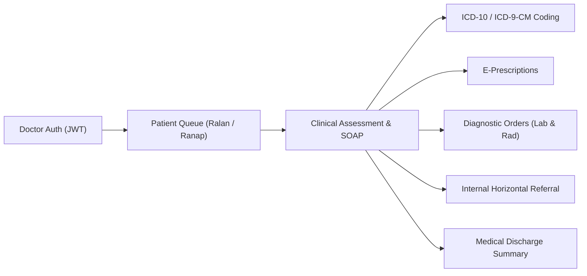

# Electronic Medical Record (EMR) Doctor Service 🏥

[](https://go.dev/)
[](#-architecture--design-principles)
[](https://www.mysql.com/)
[](#-security--data-protection)
[](#-interactive-api-documentation-scalar-ui)
[](#-observability--monitoring)

A high-performance, enterprise-grade backend REST API service engineered for the **Doctor & Clinical Electronic Medical Record (EMR / RME)** ecosystem. Developed as a modern Go re-architecture for **SIMRS Khanza**—one of the most widely adopted open-source Hospital Information Management Systems in Indonesia.

Built entirely with the **Go Standard Library (`net/http`)**, this service transitions legacy desktop/PHP hospital workflows into a cloud-ready, stateless, and high-throughput microservice adhering strictly to **Clean Architecture**, **AES-256-GCM URL Obfuscation**, rigorous **clinical boundary validations**, and embedded **OpenAPI 3.1 & Scalar API Reference**.

---

## 💡 Background & Motivation

**SIMRS Khanza** is a foundational open-source Hospital Management Information System widely deployed across thousands of hospitals, public health centers (*Puskesmas*), and clinics in Indonesia. Historically, clinical examinations were bound to desktop client architectures (Java Swing) or legacy web interfaces (PHP).

This service decouples the mission-critical **Doctor Clinical Workflow** into an independent, scalable RESTful microservice:
- **Zero Framework Overhead**: Utilizes Go 1.22+ standard routing (`http.ServeMux`), delivering sub-millisecond response latencies and minimal memory footprint.
- **Healthcare Privacy by Design**: Protects sensitive internal medical record numbers (`no_rawat`, `no_rkm_medis`, and composite keys) against Insecure Direct Object References (IDOR) using symmetric **AES-256-GCM token obfuscation** in public URLs.
- **Strict Clinical Integrity**: Implements automated medical validation guards (SOAP consistency, physiological ranges, 48-hour audit lock, and dispensing lifecycle locks).
- **Turnkey Observability**: Built-in structured JSON logging integrated seamlessly with a pre-provisioned **Grafana Loki & Promtail** monitoring stack.

---

## 🌟 Clinical Domain Modules

The service models the complete outpatient, inpatient, and diagnostic workflow for attending physicians:



### 1. 🔐 Authentication & Medical Authorization (`internal/auth`)
- **Khanza Credential Verification**: Secure password authentication against legacy Khanza database tables using AES-128-ECB decryption.
- **Stateless JWT Sessions**: HMAC-SHA256 signed bearer tokens with configurable session duration and doctor identity claims (`kode_dokter`).
- **Doctor Ownership Isolation**: Strict access controls ensuring doctors can only mutate or delete clinical assessments authored by themselves.

### 2. 📋 Outpatient & Doctor Queue Management (`internal/rawatjalan`)
- **Real-Time Patient Queues**: Filter outpatient visits by examination status (`Belum`, `Sudah`, `Batal`, `Berkas Diterima`, etc.), insurance/payer (`BPJS`, private, cash), visit status (`Ralan`, `Ranap`), and referral type.
- **Dynamic Search & Pagination**: Multi-column sorting (`waktu_registrasi`, `nama_pasien`), date-range filtering, and full-text keyword indexing across patient names, medical record numbers, and encounter IDs.
- **Comprehensive Visit Details**: Enriched encounter profiles including clinical triage and insurance metadata.

### 3. 🛏️ Inpatient Bed & Ward Tracking (`internal/rawatinap`)
- **Active Occupancy Detection**: Evaluates active bed occupancy (`kamar_inap`) by tracking discharge timestamps and checkout flags.
- **Encounter State Validation**: Automatically prevents accidental outpatient orders on active inpatients and enforces bed state rules.

### 4. 🩺 Clinical Examinations — SOAP & Vital Signs (`internal/pemeriksaan`)
- **Structured SOAP Documentation**: Standardized Subjective, Objective, Assessment, and Plan workflow.
- **Physiological Range & Neurological Validations**:
  - Systolic & Diastolic Blood Pressure thresholds.
  - Temperature, Heart Rate, Respiratory Rate, and SpO2 ranges.
  - Neurological Consciousness Scales: **GCS** (Glasgow Coma Scale) and **AVPU** (*Compos Mentis, Somnolence, Sopor, Coma, Alert, Confusion, Voice, Pain, Unresponsive*).
- **Longitudinal History**: Retrieve chronological cross-visit medical records (`id_pasien`) or encounter-specific records (`id_kunjungan`).
- **48-Hour Medical Compliance Lock**: Clinical notes are permanently locked against modification or deletion 48 hours post-registration, conforming to legal medical record retention and audit policies.

### 5. 📋 Initial Medical Assessments (`internal/penilaianmedis`)
Specialized initial clinical evaluations tailored to specific clinical units and medical specialties:
- **Outpatient General** (*Ralan Umum*)
- **Outpatient Obstetrics & Gynecology** (*Ralan Kandungan*)
- **Emergency Department** (*IGD - Instalasi Gawat Darurat*)
- **Inpatient General** (*Ranap Umum*)
- **Inpatient Obstetrics** (*Ranap Kebidanan*)
- **Inpatient Neonatology** (*Ranap Neonatus*)

### 6. 🏷️ Diagnosis & Procedures Coding (`internal/diagnosa`)
- **ICD-10 Clinical Coding**: Record confirmed disease classifications with primary vs. secondary diagnosis hierarchy.
- **ICD-9-CM Procedures**: Track surgical, clinical, and diagnostic procedures performed during the visit.

### 7. 💊 Electronic Prescriptions (`internal/resep` & `internal/obat`)
- **Prescription Types**: Doctor order entry supporting both non-compound (standard medications) and compound (*racikan*) preparations with variable formulas.
- **Dosage & Administration Rules**: Standardized administration rules, frequencies, and dispensing instructions.
- **Depot Inventory Awareness**: Real-time stock and formulary lookup scoped to specific pharmacy depots.
- **Dispensing Lifecycle Lock**: Prescriptions that have been validated (`tgl_perawatan != '0000-00-00'`) or handed over by pharmacy (`tgl_penyerahan != '0000-00-00'`) are permanently locked against doctor modification.

### 8. 🧪 Diagnostic Laboratory Investigations (`internal/laboratorium` & `internal/tindakan`)
- **Multi-Discipline Support**:
  - **PK** (Clinical Pathology / *Patologi Klinik*)
  - **PA** (Anatomic Pathology / *Patologi Anatomi*)
  - **MB** (Microbiology / *Mikrobiologi*)
- **Sub-Template Result Reporting**: Detailed multi-parameter test item breakdowns and critical values.
- **Analytical Process Lock**: Laboratory orders with collected specimens (`tgl_sampel`) or verified results (`tgl_hasil`) are locked from doctor cancellation.

### 9. 🩻 Diagnostic Radiology & Imaging (`internal/radiologi`)
- **Imaging Orders & Results**: Support for X-Ray, CT Scan, MRI, and Ultrasound investigations.
- **Radiologist Expertise**: Structured reporting and findings by consulting radiologists.
- **PACS & DICOM Linkage**: Seamless integration with digital PACS servers and external image viewers.

### 10. 🔄 Internal Horizontal Referrals (`internal/rujukaninternal`)
- **Cross-Clinic Consultations**: Refer patients horizontally to other polyclinics or specialist doctors within the same encounter without requiring a secondary registration counter visit.

### 11. 📑 Medical Discharge Summaries (`internal/resumepasien`)
- **Discharge Documentation**: Comprehensive clinical summaries for Outpatient (*Ralan*) and Inpatient (*Ranap*) encounters.
- **Clinical Reconciliation**: Discharge conditions, follow-up instructions, physical findings at discharge, and medication summaries.

### 12. 📁 Universal Digital Records Streamer (`internal/berkasdigital`)
- **Secure Reverse-Proxy Streamer**: Securely serves scanned medical records, external referral letters, ECG tracings, and legacy documents without exposing internal file storage topology.

---

## 🏛️ Architecture & Design Principles

The service strictly adheres to **Clean Architecture** patterns, ensuring high maintainability, testability, and decoupled concerns:

```text
HTTP Request (Client)
       │
       ▼
┌────────────────────────────────────────────────────────┐
│  Middleware Pipeline                                   │
│  - Request ID Tracing                                  │
│  - Structured Access Logging                           │
│  - CORS (Cross-Origin Resource Sharing)                │
│  - Rate Limiting (Sliding Window per IP)               │
│  - JWT Bearer Authentication                           │
│  - Context Timeout (30s Resiliency Barrier)            │
└───────────────────────┬────────────────────────────────┘
                        │
                        ▼
┌────────────────────────────────────────────────────────┐
│  Handler Layer (internal/<domain>/handler*.go)         │
│  - HTTP Request Unmarshaling                           │
│  - URL Obfuscation: AES-256-GCM Decryption (URL -> DB) │
│  - Non-DB Input Validation: req.Validate()             │
│  - Identity & Parent Entity Verification               │
│  - Response AES-256-GCM Encryption (DB -> URL)         │
│  - Standardized JSON Envelope Formatting               │
└───────────────────────┬────────────────────────────────┘
                        │
                        ▼
┌────────────────────────────────────────────────────────┐
│  Service Layer (internal/<domain>/service*.go)         │
│  - Pure Domain & Business Logic                        │
│  - Medical Rules & Temporal Validations (48-hr lock)   │
│  - Cross-Package Service Invocations                   │
│  - Zero Cryptographic / HTTP dependencies              │
└───────────────────────┬────────────────────────────────┘
                        │
                        ▼
┌────────────────────────────────────────────────────────┐
│  Repository Layer (internal/<domain>/repository*.go)   │
│  - Direct SQL Queries (SIMRS Khanza Database)          │
│  - Atomic Transactions (BeginTx, Commit, Rollback)     │
│  - Zero Intermediary Structs (Scans directly to Model) │
└───────────────────────┬────────────────────────────────┘
                        │
                        ▼
       Database (MySQL / MariaDB 'sik')
```

### Key Engineering Standards
1. **Composition Over Repetition**: Clinical models share standardized medical blocks (vitals, consultation headers) using **Go Struct Embedding** (`model_common.go`).
2. **Zero Redundant Code**: Handler layers verify parent entity integrity (`idComposite.NoRawat != noRawatURL`) to prevent multi-tab state pollution, while state validations remain isolated within the Service layer.
3. **Strict Separation of Mutation & Validation**:
   - `Sanitize()`: Pure data trimming and format normalization. Never returns an error.
   - `Validate()`: Read-only evaluation of clinical boundaries. Never mutates struct fields.
4. **Cross-Package Service Boundary**: Modules interact with other domains strictly via **Service-to-Service** calls; cross-domain repository injection is strictly forbidden.

---

## 🛡️ Security & Data Protection

| Security Mechanism | Implementation Details |
| :--- | :--- |
| **URL Token Obfuscation** | Symmetrically encrypts database primary keys (`no_rawat`, `no_rkm_medis`, composite keys) into tamper-proof **AES-256-GCM** hex tokens. Eliminates IDOR and sequential harvesting vulnerabilities. |
| **Authentication** | HMAC-SHA256 JWT tokens with encrypted credentials verification against Khanza user tables. |
| **Brute-Force Rate Limiting** | Sliding window rate limiter guarding authentication endpoints (10 attempts/minute default). |
| **Resiliency & Timeouts** | Automated 30-second context timeout propagation across database queries to prevent connection pool exhaustion. |
| **Medical Integrity Guard** | 48-hour post-registration lock on clinical evaluations; analytical status lock on laboratory investigations; dispensing lock on e-prescriptions. |

---

## 📊 Observability & Monitoring

The service includes an enterprise-ready logging and observability architecture configured via Docker Compose:

- **Structured JSON Logging**: Every request, database query latency, and domain error is logged as structured JSON tagged with correlation IDs (`request_id`).
- **Promtail**: Seamlessly collects and ships application log streams from `./logs/app.log` to Loki.
- **Grafana Loki**: High-scale log aggregation engine.
- **Grafana**: Pre-provisioned dashboards configured out-of-the-box (`monitoring/grafana/dashboards/erm_dokter_dashboard.json`).

```bash
# Launch the complete observability stack
docker compose -f docker-compose.monitoring.yml up -d
```
Access Grafana at [http://localhost:3000](http://localhost:3000) (Default: `admin` / `admin`).

---

## 📁 Repository Directory Structure

```text
erm-dokter/
├── cmd/
│   └── api/
│       └── main.go                         # Service entrypoint & graceful shutdown
├── internal/
│   ├── auth/                               # Doctor authentication & JWT generation
│   ├── berkasdigital/                      # Universal digital record reverse proxy
│   ├── config/                             # Environment configuration loader
│   ├── di/                                 # Dependency Injection container
│   ├── diagnosa/                           # ICD-10 & ICD-9-CM diagnosis & procedures
│   ├── docs/                               # Scalar UI & OpenAPI 3.1 YAML handlers
│   ├── health/                             # Health check probe (GET /health)
│   ├── laboratorium/                       # Lab orders & results (PK, PA, MB)
│   ├── master/                             # Reference catalogs (Payers, Depots, Clinics)
│   ├── middleware/                         # Auth, CORS, Rate Limit, Timeout, Tracing
│   ├── obat/                               # Medication master & stock search
│   ├── pasien/                             # Patient demographics & encounter timelines
│   ├── pemeriksaan/                        # SOAP, Vital signs, GCS/AVPU & 48h audit lock
│   ├── penilaianmedis/                     # Initial assessments (Ralan, IGD, Ranap, Obgyn)
│   ├── pkg/                                # Core shared infrastructure:
│   │   ├── crypto/                         # AES-256-GCM obfuscation & AES-128 Khanza
│   │   ├── database/                       # MySQL connection pool configuration
│   │   ├── logger/                         # Structured JSON logger
│   │   ├── response/                       # Standardized JSON response envelope
│   │   └── token/                          # JWT claim generator & validator
│   ├── radiologi/                          # Radiology orders, expertise & PACS viewer
│   ├── rawatinap/                          # Inpatient bed tracking & checkout status
│   ├── rawatjalan/                         # Outpatient queue, filters & visit details
│   ├── resep/                              # E-Prescriptions (Non-racikan & Racikan)
│   ├── resumepasien/                       # Outpatient & Inpatient discharge summaries
│   ├── routes/                             # Centralized HTTP ServeMux route registry
│   ├── rujukaninternal/                    # Cross-polyclinic horizontal referrals
│   ├── shared/                             # Custom app errors, pagination & status enums
│   └── tindakan/                           # Medical procedures & laboratory tariff master
├── monitoring/                             # Observability provisioning:
│   ├── grafana/                            # Grafana datasources & dashboard definitions
│   ├── loki-config.yml                     # Loki log ingestion configuration
│   └── promtail-config.yml                 # Promtail log shipping configuration
├── docker-compose.monitoring.yml           # Grafana + Loki + Promtail orchestration
├── .air.toml                               # Air live-reload configuration
├── .env.example                            # Environment variable template
├── Makefile                                # Build and run automation shortcuts
├── go.mod                                  # Go module definitions
└── go.sum                                  # Dependency checksums
```

---

## ⚙️ Getting Started

### Prerequisites
- **Go**: Version 1.22 or higher
- **Database**: MySQL 5.7+ / 8.0+ or MariaDB 10.3+ with SIMRS Khanza schema (`sik`)
- **Docker & Docker Compose** *(Optional, for Grafana/Loki monitoring)*
- **Air** *(Optional, for live reload)*: `go install github.com/air-verse/air@latest`

### 1. Clone & Configure Environment
```bash
git clone https://github.com/khoirir/erm-dokter.git
cd erm-dokter
cp .env.example .env
```

Configure your local database credentials and 32-character AES secret key in `.env`:
```env
APP_ENV=development
APP_PORT=8082
APP_NAME=erm-dokter

DB_HOST=127.0.0.1
DB_PORT=3306
DB_USER=root
DB_PASSWORD=your_secure_password
DB_NAME=sik

JWT_SECRET=your_super_secret_jwt_key_here
USER_KEY=your_khanza_user_aes_key
PASSWORD_KEY=your_khanza_password_aes_key
ENCRYPTION_KEY=32_character_aes_encryption_key_!

CORS_ORIGIN=*
MAX_EDIT_REKAM_MEDIS_JAM=48

LOG_FORMAT=json
LOG_LEVEL=info
LOG_FILE_PATH=logs/app.log
```

### 2. Download Dependencies
```bash
go mod tidy
```

### 3. Run the Service

- **Using Live Reload (Recommended for Development)**:
  ```bash
  air
  ```
- **Using Makefile**:
  ```bash
  make run
  ```
- **Using Native Go Toolchain**:
  ```bash
  go run cmd/api/main.go
  ```

The server initializes at `http://localhost:8082`.

---

## 📖 Interactive API Documentation (Scalar UI)

Interactive OpenAPI documentation is embedded directly into the application binary—no external servers or internet access required:

- **Scalar API Reference UI**: [http://localhost:8082/docs](http://localhost:8082/docs)
- **OpenAPI 3.1.0 Specification YAML**: [http://localhost:8082/docs/openapi.yaml](http://localhost:8082/docs/openapi.yaml)

### Standardized Response Envelope
All API endpoints return a predictable, standardized JSON envelope:

#### Success Response with Pagination Meta
```json
{
  "success": true,
  "message": "Berhasil mengambil daftar antrean dokter",
  "data": [
    {
      "id_kunjungan": "a3f1c98e72...",
      "id_pasien": "b8d2e41a90...",
      "nama_pasien": "JOHN DOE",
      "waktu_registrasi": "2026-09-21 08:30:00",
      "status_lanjut": "Ralan",
      "nama_penjamin": "BPJS KESEHATAN"
    }
  ],
  "meta": {
    "total_records": 48,
    "total_pages": 3,
    "current_page": 1,
    "per_page": 20
  }
}
```

#### Standardized Error Response
```json
{
  "success": false,
  "message": "Validasi gagal: Tensi diastolik harus dalam rentang 40 - 150 mmHg"
}
```

---

## 🧪 Testing & Verification

Unit test coverage verifies domain logic, input sanitization, medical boundary ranges, and AES token obfuscation without touching production databases:

```bash
# Execute full unit test suite
go test -v ./...

# Run tests with race condition detector
go test -race ./...
```

---

## 📄 License

This project is released under the **MIT License**. Engineered for hospital modernization, interoperability, and high-reliability clinical healthcare workflows.
